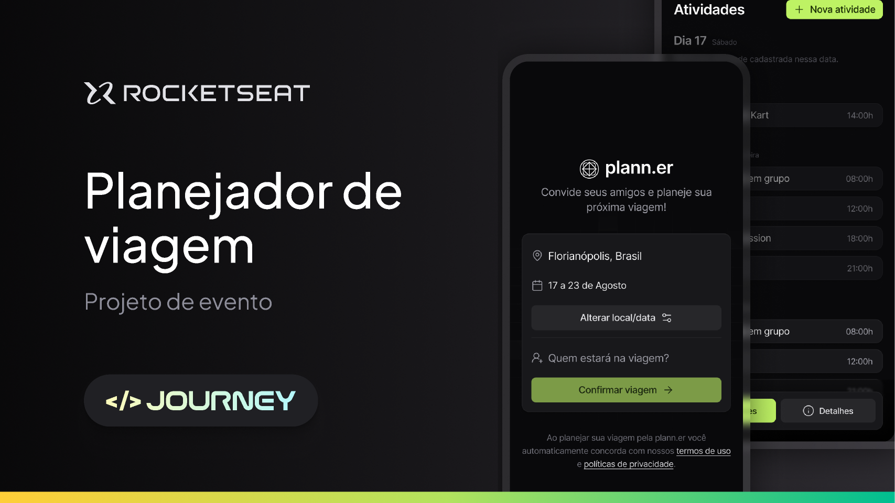

# NLW JOURNEY - BACKEND APP
Backend da Aplicação de Planejador de Viagens desenvolvida durante o NLW JOURNEY

<h1 align="center">
  
</h1>

## Rotas
- [x] Create new trip (`POST /trips`);
- [x] Register user (`POST /users`);
- [x] Authenticate user by magic link (`GET /authenticate`);
- [x] Confirm trip (`PATCH /trips/:id/confirm`);
- [x] Trip details (`GET /trips/:id`);
- [x] Update trip (`PUT /trips/:id`);
- [x] Get trip activities (`GET /trips/:id/activities`);
- [x] Create trip activity (`POST /trips/:id/activities`);
- [x] Get trip links (`GET /trips/:id/links`);
- [x] Create trip link (`POST /trips/:id/links`);
- [x] Get the trip participants (`GET /trips/:id/participants`);
- [x] Create a new invite (`POST /trips/:id/invites`);
- [x] Get user confirmation status for trip (`GET /trips/:id/confirmation-status`);

## 💻 Tecnologias Utilizadas nesse Projeto
<div style="display: inline_block">
  
  
  
  
</div>

<br>

## Especificações
- Node: 20.14.0
- Pacote de Gerenciamento de Dependências: PNPM
- Framework: Fastify

<br>

## Observações
Necessário configurar um arquivo .env antes de rodar o projeto
```bash
DATABASE_URL="file:./dev.db"
API_BASE_URL="http://localhost:3333"
WEB_BASE_URL="http://localhost:3000"
PORT=3333
```

<br>

## Como instalar as dependências
```bash
$ pnpm install
```

## Rodar o Projeto
```bash
$ pnpm run dev
```
